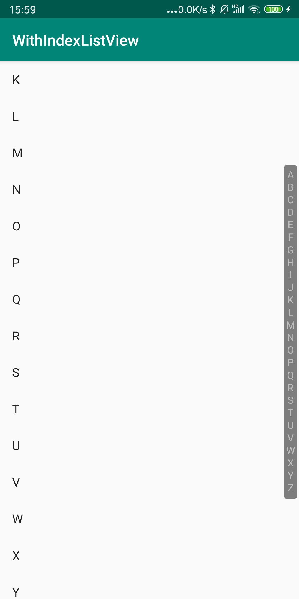

# WithIndexListView
[](https://bintray.com/cbasc1989/com.boiqin/WithIndexListView/1.0.1/link)
Android的带索引的列表控件。   

本控件的发布离不开[https://github.com/xingty/IndexableExpandableListView](https://github.com/xingty/IndexableExpandableListView)，在此非常感谢作者的分享。

相对于原项目，本项目进行kotlin重写，并做了一些修改

有问题可以在issue提出

 


#功能说明

* 快速索引功能
* 支持设置字体大小、背景颜色，透明度等。
* 可以设置自己的画笔(如果需要)

#属性说明  
> indexBarFontSize 索引栏内部文字大小(索引栏宽度由字体大小决定)   
> indexBarAlpha 索引栏和预览框的透明度,如果为0,预览框不会被绘制   
> indexBarPadding 索引栏的内边距   
> leading 索引栏字体间距
> indexBarMargin 索引栏右边的距离   
> indexBarTextColor 字体颜色   
> showPreview 是否显示预览框   


#示例
```
1. 在项目build.gradle中的dependencies添加
    implementation 'com.boiqin:WithIndexListView:1.0.1'
```
```
2. 在XML中使用  
<com.boiqin.listview.WithIndexListView
	    xmlns:android="http://schemas.android.com/apk/res/android"    
	    xmlns:app="http://schemas.android.com/apk/res-auto"   
	    android:id="@+id/listview"    
	    android:layout_width="match_parent"   
	    android:layout_height="match_parent"   
	    android:groupIndicator="@null"/> 
```
``` kotlin
3. 写一个Adapter继承 WithIndexExpandableListView，然后返回分组列表即可

class MyExpandableListAdapter : WithIndexExpandableListAdapter() {

    override val indexList: List<String>
        get() = group
}  
```
```
4. 调用setIndexableAdapter来设置Adapter
listView.setWithIndexAdapter(adapter)

```


## License

    Copyright 2019 boiqin

    Licensed under the Apache License, Version 2.0 (the "License");
    you may not use this file except in compliance with the License.
    You may obtain a copy of the License at

       http://www.apache.org/licenses/LICENSE-2.0

    Unless required by applicable law or agreed to in writing, software
    distributed under the License is distributed on an "AS IS" BASIS,
    WITHOUT WARRANTIES OR CONDITIONS OF ANY KIND, either express or implied.
    See the License for the specific language governing permissions and
    limitations under the License.
